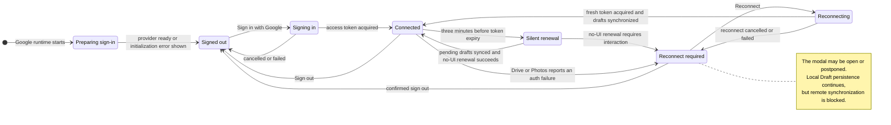
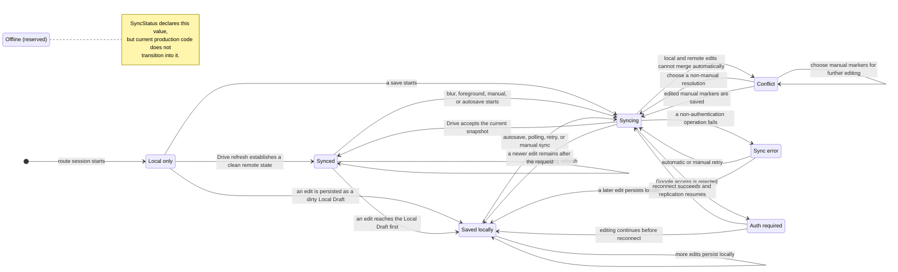

# Sync and Connection Statuses

Jot has two related but independent kinds of state:

- **Connection state** describes whether Google access is available. It is derived from route signals such as
  `authenticated`, `preparingAuth`, `signingIn`, `authReconnectRequired`, and `reconnectingAuth`; there is no single
  `ConnectionStatus` type.
- **Sync status** describes the selected Daily Note's local and remote replication state. It is represented by
  `SyncStatus` and drives the status disk's label and color.

Being connected does not imply that the selected Daily Note is synced. It may still be saved only locally, syncing,
conflicted, or in error.

## Effective Connection State

Silent renewal is an internal transient state rather than a separate user-visible signal. Jot first uses the still-valid
token to synchronize pending drafts. If renewal then fails, it invalidates the cached token and requires an interactive
reconnect. Jot does not currently derive a connection state from `navigator.onLine`; ordinary network failures enter the
sync error path below.

## Selected Daily Note Sync Status

The status disk maps the selected note's `SyncStatus` as follows:

| Disk | Sync statuses | Meaning |
| --- | --- | --- |
| Green | `synced` | The current canonical content and revision have been acknowledged remotely. |
| Yellow | `local-only`, `saved-locally`, `syncing`, `offline` | No immediate conflict is known, but the state is not currently acknowledged as synced. `syncing` pulses. |
| Red | `auth-required`, `conflict`, `error` | User action or recovery is required. |

## Coupling Between the Two State Machines

- Entering **Reconnect required** initially sets the selected note's sync status to `auth-required`.
- The connection flag remains authoritative. If another edit is persisted while reconnect is required, the sync status
  can become `saved-locally`; remote autosave remains blocked and clicking the disk still starts reconnect.
- A successful reconnect clears the connection requirement, refreshes the selected Daily Note, and synchronizes dirty
  drafts for other dates. The resulting sync status depends on those replication results.
- A Sync Conflict is not a connection failure. Jot remains connected, but editing and diagnostics collection pause while
  the conflict decision dialog is open.
- Signing out resets the visible sync status to `local-only` after the user confirms deletion of unsynced local data when
  necessary.

The normative replication guarantees remain in [sync-safety.md](sync-safety.md); the bounded executable model is
described in [sync-model.md](sync-model.md).
